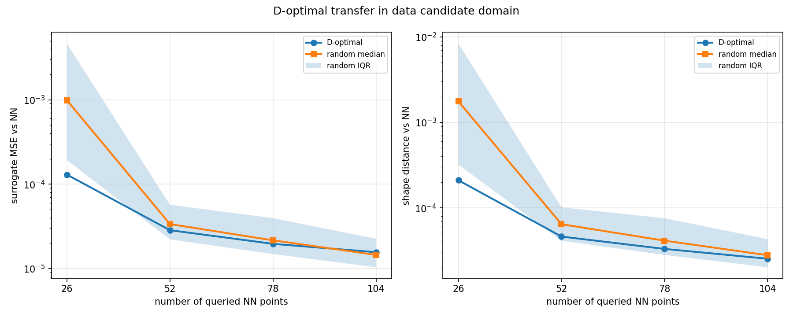
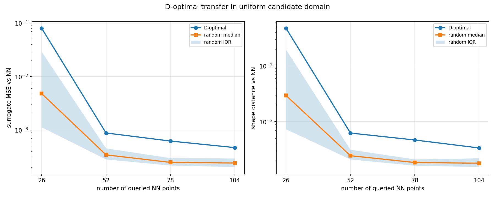
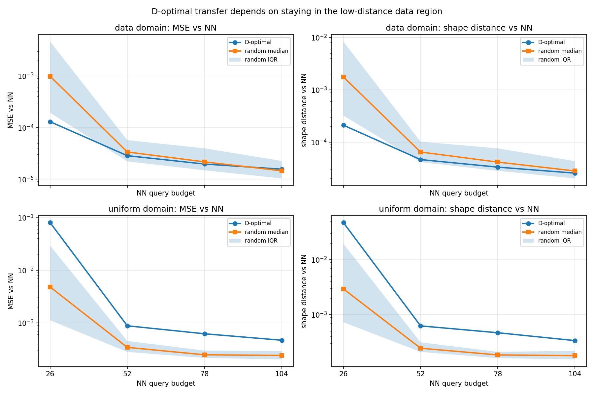

# D-optimal 杩佺Щ瀹為獙鎶ュ憡

## 1. 瀹為獙闂

鍓嶉潰鐨勫疄楠屽凡缁忚鏄庯細鍦ㄦ煇浜?setting 涓紝NN 涓?FullPR 鐨勫嚑浣曡窛绂婚潪甯稿皬銆傝繖鑷劧寮曞嚭涓€涓棶棰橈細

**濡傛灉 NN 鍦ㄦ暟鎹尯鍐呭嚑涔庣瓑浠蜂簬 FullPR锛岄偅涔堜紶缁熷椤瑰紡鍥炲綊閲岀殑 D-optimal 璁捐锛岃兘涓嶈兘杩佺Щ鍒?NN 杩欎釜鏂版ā鍨嬩笂锛?*

杩欓噷鐨勨€滆縼绉烩€濅笉鏄寚 D-optimal 鐩存帴鐭ラ亾 NN 鐨勫唴閮ㄧ粨鏋勶紝鑰屾槸鎸囷細

1. 鍙娇鐢?FullPR 鐨勭壒寰佺煩闃佃璁￠噰鏍风偣锛?2. 鎶婅缁冨ソ鐨?NN 褰撴垚涓€涓彲鏌ヨ榛戠锛?3. 鍦?D-optimal 閫夊嚭鐨勭偣涓婃煡璇?NN锛?4. 鐢ㄨ繖浜涚偣鎷熷悎涓€涓?FullPR surrogate锛?5. 鐪嬪畠鏄惁姣斿悓鏍锋暟閲忕殑闅忔満鐐规洿楂樻晥鍦板鍒?NN銆?
濡傛灉鎴愮珛锛屽氨璇存槑锛?*褰?NN 涓?FullPR 璺濈瓒冲灏忔椂锛岃€佺殑澶氶」寮忓疄楠岃璁℃妧鏈彲浠ョ敤浜庢柊鐨?NN 妯″瀷閲囨牱/钂搁銆?*

---

## 2. 閫夊彇鐨勪綆璺濈渚嬪瓙

鏈疄楠岄€夋嫨锛?
- 鏁版嵁闆嗭細`paper_poly3`
- 婵€娲诲嚱鏁帮細`tanh`
- NN 缁撴瀯锛歚hidden=(16,8,4)`
- FullPR锛氫笁闃?FullPR锛屽寘鍚?`sin(x_i)` 涓?`exp(x_i)` 鐗规畩椤?- 鏁版嵁绉嶅瓙锛歚data_seed=0`
- 鍒濆鍖栫瀛愶細`init_seed=0`

鍦ㄥ師濮嬫祴璇曢泦涓婏紝NN 涓?FullPR 宸茬粡闈炲父鎺ヨ繎锛?
| 鎸囨爣 | 鏁板€?|
|------|------:|
| NN MSE vs y | 3.53e-05 |
| FullPR MSE vs y | 6.01e-09 |
| FullPR MSE vs NN | 3.53e-05 |
| shape(NN, FullPR) | 4.56e-05 |

杩欎釜 setting 婊¤冻鈥淣N 鍜?FullPR 璺濈杈冨皬鈥濈殑鍓嶆彁銆?
---

## 3. D-optimal 璁捐鏂瑰紡

鍊欓€夎緭鍏ョ偣鏈変袱绉嶇増鏈細

1. **data domain**锛氬€欓€夌偣鏉ヨ嚜鍘熷鏁版嵁鍒嗗竷锛屽苟闄愬埗鍦ㄥ師璁粌缂╂斁鍚庣殑 `[-1,1]^3` 鏁版嵁鍖哄唴銆?2. **uniform domain**锛氬€欓€夌偣鍧囧寑閾烘弧鏁翠釜 `[-1,1]^3` 绔嬫柟浣撱€?
D-optimal 鍙湅 FullPR 鐨勮璁＄煩闃碉細

$$
X_{\mathrm{design}} = [1,\ \phi_1(x),\ldots,\phi_p(x)]
$$

鍏朵腑 $\phi_j(x)$ 鏄?FullPR 鐨勫椤瑰紡涓庣壒娈婇」鐗瑰緛銆傞€夋嫨鐩爣鏄

$$
\det(X_S^\top X_S)
$$

灏藉彲鑳藉ぇ锛屽嵆璁╅€夊嚭鏉ョ殑鐐瑰澶氶」寮忓弬鏁颁及璁℃渶鏈変俊鎭噺銆?
閫夌偣鍚庯紝瀹為獙鏌ヨ NN 杈撳嚭 $\hat y_{NN}(x)$锛屽啀鐢ㄨ繖浜涚偣鎷熷悎 FullPR surrogate锛屽苟鍦ㄧ嫭绔嬭瘎浼扮偣涓婃瘮杈冿細

- surrogate MSE vs NN锛?- surrogate 涓?NN 鐨?shape distance銆?
闅忔満鍩哄噯涓猴細鍚屾牱棰勭畻涓嬮殢鏈洪€夌偣锛岄噸澶?100 娆★紝鎶ュ憡涓綅鏁板拰鍥涘垎浣嶅尯闂淬€?
---

## 4. 鏁版嵁鍖哄唴鐨勭粨鏋滐細鏀寔杩佺Щ

鍦?data domain 涓紝D-optimal 鏄庢樉浼樹簬闅忔満璁捐锛屽挨鍏跺湪灏忔牱鏈绠椾笅浼樺娍鏈€寮恒€?
| NN 鏌ヨ鐐规暟 | D-opt MSE vs NN | 闅忔満涓綅 MSE | MSE 鏀瑰杽 | D-opt shape | 闅忔満涓綅 shape | shape 鏀瑰杽 |
|------------:|----------------:|-------------:|---------:|------------:|---------------:|-----------:|
| 26 | 1.30e-04 | 9.88e-04 | +86.9% | 2.10e-04 | 1.76e-03 | +88.1% |
| 52 | 2.85e-05 | 3.36e-05 | +15.3% | 4.56e-05 | 6.36e-05 | +28.3% |
| 78 | 2.00e-05 | 2.20e-05 | +9.2% | 3.29e-05 | 4.11e-05 | +19.9% |
| 104 | 1.62e-05 | 1.50e-05 | -7.6% | 2.55e-05 | 2.80e-05 | +9.1% |

瑙ｉ噴锛?
- 褰撴煡璇㈤绠楃瓑浜庡弬鏁版暟鐩檮杩戯紙26 涓偣锛夋椂锛孌-optimal 鍑犱箮鏄殢鏈鸿璁＄殑鏁伴噺绾ф敼杩涖€?- 棰勭畻澧炲姞鍒?52 鍜?78 鍚庯紝D-optimal 浠嶇劧鍦?MSE 涓庡舰鐘惰窛绂讳笂浼樹簬闅忔満涓綅鏁般€?- 鍒?104 涓偣鏃讹紝闅忔満璁捐宸茬粡瑕嗙洊寰楄冻澶熷瘑锛孧SE 涓綅鏁扮暐浼樹簬 D-optimal锛涗絾 D-optimal 鐨?shape distance 浠嶇劧鏇村皬銆?
杩欒鏄庯細**鍦?NN 涓?FullPR 宸茬煡鎺ヨ繎鐨勬暟鎹尯鍐咃紝D-optimal 杩欎釜浼犵粺澶氶」寮忚璁℃柟娉曠‘瀹炲彲浠ユ洿楂樻晥鍦伴噰鏍?澶嶅埢 NN銆?*

---

## 5. 鍏ㄧ珛鏂逛綋涓婄殑缁撴灉锛氳竟鐣屽緢閲嶈

褰撳€欓€夌偣鏀逛负鏁翠釜 `[-1,1]^3` 绔嬫柟浣撴椂锛岀粨璁哄弽杩囨潵锛欴-optimal 鏄庢樉宸簬闅忔満銆?
| NN 鏌ヨ鐐规暟 | D-opt MSE vs NN | 闅忔満涓綅 MSE | MSE 鏀瑰杽 | D-opt shape | 闅忔満涓綅 shape | shape 鏀瑰杽 |
|------------:|----------------:|-------------:|---------:|------------:|---------------:|-----------:|
| 26 | 7.98e-02 | 4.79e-03 | -1564.2% | 4.75e-02 | 2.95e-03 | -1510.7% |
| 52 | 8.79e-04 | 3.43e-04 | -156.4% | 6.24e-04 | 2.45e-04 | -155.1% |
| 78 | 6.21e-04 | 2.48e-04 | -150.7% | 4.68e-04 | 1.85e-04 | -153.7% |
| 104 | 4.68e-04 | 2.41e-04 | -94.3% | 3.37e-04 | 1.79e-04 | -87.8% |

杩欎笉鏄?D-optimal 鈥滃け鏁堚€濊繖涔堢畝鍗曪紝鑰屾槸鎻ず浜嗕竴涓叧閿竟鐣岋細

**NN 涓?FullPR 鐨勮窛绂诲皬锛屾槸鍦ㄥ師鏁版嵁鍖哄唴娴嬪緱鐨勶紱D-optimal 鑻ヨ鍏佽鍘绘暣涓珛鏂逛綋杈圭晫閫夌偣锛屼細涓诲姩閫夋嫨杈圭晫/瑙掔偣锛岃€岃繖浜涘湴鏂规伆鎭板彲鑳芥槸 NN 涓庡椤瑰紡澶栨帹琛屼负鍒嗘鏈€澶х殑鍖哄煙銆?*

鍥犳锛屼紶缁熻璁℃妧鏈彲浠ヨ縼绉伙紝浣嗚縼绉绘潯浠舵槸锛?
- 鍊欓€夊煙蹇呴』闄愬埗鍦?NN-FullPR 宸茬煡鎺ヨ繎鐨勫尯鍩燂紱
- 涓嶈兘鎶娾€滄暟鎹尯鍐呮帴杩戔€濆鎺ㄦ垚鈥滄暣涓緭鍏ョ┖闂撮兘鎺ヨ繎鈥濓紱
- 鑻ヨ鍦ㄥ鎺ㄥ尯浣跨敤 D-optimal锛岄渶瑕佸厛楠岃瘉 NN 涓?FullPR 鍦ㄥ鎺ㄥ尯涔熸帴杩戯紝鎴栨敼鐢ㄥ甫鍖哄煙绾︽潫/椴佹鎬х殑璁捐鍑嗗垯銆?
---

## 6. 鍚堝苟瀵圭収鍥?

杩欏紶鍥炬妸涓や釜鍊欓€夊煙鏀惧湪涓€璧凤細

- 涓婃帓锛歞ata domain锛孌-optimal 閫氬父浼樹簬闅忔満锛?- 涓嬫帓锛歶niform domain锛孌-optimal 绯荤粺鎬у樊浜庨殢鏈恒€?
鏈€閲嶈鐨勭粨璁轰笉鏄€淒-optimal 鎬绘槸濂解€濓紝鑰屾槸锛?
**褰?NN 涓?FullPR 鍦ㄦ煇涓尯鍩熷唴璺濈杈冨皬鏃讹紝D-optimal 鍙互鍦ㄨ鍖哄煙鍐呰縼绉伙紱涓€鏃︾寮€杩欎釜浣庤窛绂诲尯鍩燂紝鑰佹妧鏈細鎶婇噰鏍锋帹鍚戞ā鍨嬪垎姝ф渶澶х殑鍦版柟锛屽弽鑰屽彉宸€?*

---

## 7. 鍙啓杩涜鏂?鎶ュ憡鐨勭粨璁?
鏈疄楠屾敮鎸佷竴涓湁杈圭晫鐨勮縼绉诲懡棰橈細

> 鍦?NN 涓?FullPR 鐨勫嚑浣曡窛绂诲緢灏忕殑鏁版嵁鍖哄煙鍐咃紝鍩轰簬 FullPR 鐗瑰緛绌洪棿鐨?D-optimal 璁捐鑳藉鏇撮珮鏁堝湴鏌ヨ骞惰捀棣?NN锛岃鏄庝紶缁熷椤瑰紡鍥炲綊鐨勫疄楠岃璁℃柟娉曞彲浠ヨ縼绉诲埌鏂扮殑绁炵粡缃戠粶妯″瀷涓娿€備絾杩欑杩佺Щ涓嶆槸鍏ㄥ眬鏃犳潯浠舵垚绔嬬殑锛氳嫢鍊欓€夊煙鎵╁睍鍒?NN 涓庡椤瑰紡澶栨帹琛屼负涓嶄竴鑷寸殑鍖哄煙锛孌-optimal 浼氫紭鍏堥€夋嫨杈圭晫鐐瑰苟瀵艰嚧 surrogate 璇樊鍙樺ぇ銆?
鎹㈠彞璇濊锛?
**鈥淣N 鍍忓椤瑰紡鈥濅笉浠呰兘瑙ｉ噴妯″瀷锛屼篃鑳借鑰佺殑澶氶」寮忔妧鏈湪鍚堥€傚尯鍩熷唴閲嶆柊鍙敤锛涗絾杩欎釜鍙敤鎬т緷璧栦簬鍑犱綍璺濈鏈韩锛屽繀椤诲厛纭浣庤窛绂诲尯鍩熷湪鍝噷銆?*

