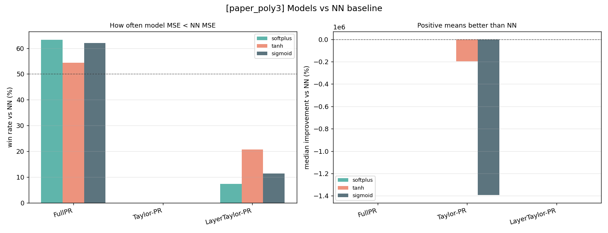
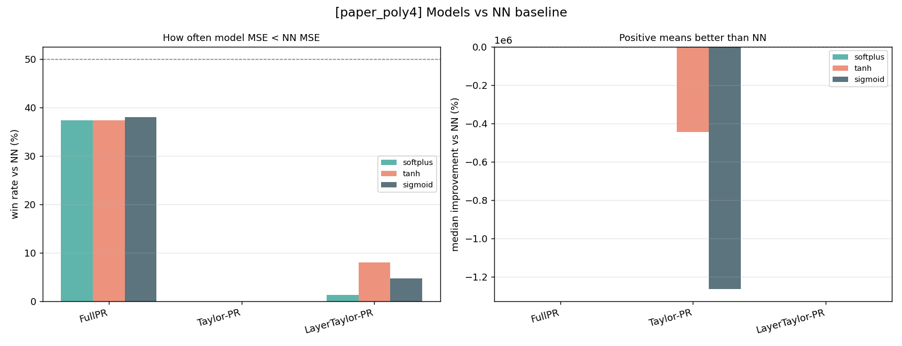
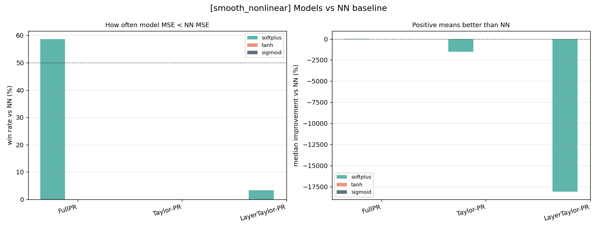
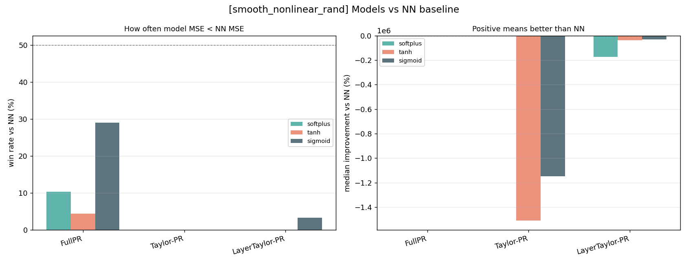

# NN 鍩哄噯瀵规瘮鎶ュ憡

鏈姤鍛婁笓闂ㄥ洖绛斾竴涓棶棰橈細**鍦ㄦ湰娆″疄楠屼腑锛屽鏋滄妸 NN 褰撲綔鍩哄噯锛屽摢浜涙ā鍨嬫洿濂斤紵**

杩欓噷鐨?鏇村ソ"鍙寜棰勬祴璇樊鍒ゆ柇锛氬鏋滄煇涓ā鍨嬬殑 `MSE vs y` 灏忎簬 `NN_mse_vs_y`锛屽氨璁颁负璇ユā鍨嬪湪杩欐 run 涓儨杩?NN銆傛柊鐢熸垚鐨?`results_<case>_nn_baseline.png` 瀵硅繖涓垽鏂仛浜嗗彲瑙嗗寲銆?
---

## 1. 濡備綍璇?`nn_baseline` 鍥?
姣忎釜鏁版嵁闆嗗搴斾竴寮?`results_<case>_nn_baseline.png`锛屽浘閲屾湁涓や釜闈㈡澘锛?
- **宸﹀浘锛歸in rate vs NN (%)**  
  琛ㄧず妯″瀷鍦ㄥ灏戞瘮渚嬬殑 run 涓瘮 NN 鐨?MSE 鏇村皬銆?0% 铏氱嚎鏄垎鐣岀嚎锛氳秴杩?50% 琛ㄧず璇ユā鍨嬪鏁版椂鍊欒耽 NN锛屼綆浜?50% 琛ㄧず澶氭暟鏃跺€?NN 璧€?
- **鍙冲浘锛歮edian improvement vs NN (%)**  
  琛ㄧず鐩稿 NN 鐨勪腑浣嶆敼鍠勭櫨鍒嗘瘮锛?
$$
\text{improvement} = 100 \times \frac{\mathrm{MSE}_{NN} - \mathrm{MSE}_{model}}{\mathrm{MSE}_{NN}}.
$$

  0% 铏氱嚎鏄垎鐣岀嚎锛氭鍊艰〃绀烘ā鍨嬫瘮 NN 鏇村ソ锛岃礋鍊艰〃绀烘ā鍨嬫瘮 NN 鏇村樊銆傝繖閲屼娇鐢ㄤ腑浣嶆暟锛屾槸涓轰簡閬垮厤 Taylor 灞曞紑鍋跺彂鐖嗙偢鍊兼妸鍧囧€间弗閲嶆媺鍋忋€?
---

## 2. 鎬讳綋缁撹

娓呮礂鎺夋湭鏀舵暃 NN run 鍚庯紝鏈鍒嗘瀽鍖呭惈 **2960 涓湁鏁?run**銆傛€讳綋缁撴灉濡備笅锛?
| 妯″瀷 | 鏈夋晥 run | 鐩稿 NN 鑳滅巼 | 涓綅鏀瑰杽 |
|------|---------:|-------------:|---------:|
| FullPR | 2960 | 38.9% | -85.3% |
| Taylor-PR | 982 | 0.0% | -143955.8% |
| LayerTaylor-PR | 2960 | 5.6% | -1392.6% |

鎬讳綋涓婏紝**NN 鏄洿绋崇殑棰勬祴鍩哄噯**銆侳ullPR 鏄敮涓€鑳藉拰 NN 褰㈡垚鐪熷疄绔炰簤鐨勬ā鍨嬶紝浣嗗悎骞舵墍鏈夋暟鎹泦鍚庝粛鐒朵綆浜?NN銆俆aylor-PR 鍜?LayerTaylor-PR 鐨勪富瑕佷环鍊间笉鍦ㄤ簬鍑昏触 NN锛岃€屽湪浜庤В閲婃垨澶嶅埢 NN锛涘畠浠竴鏃﹁秴鍑烘嘲鍕掕繎浼肩殑閫傜敤鑼冨洿锛屾€ц兘浼氭€ュ墽鎭跺寲銆?
---

## 3. 鍒嗘暟鎹泦缁撹

### paper_poly3

| 妯″瀷 | 鐩稿 NN 鑳滅巼 | 涓綅鏀瑰杽 |
|------|-------------:|---------:|
| FullPR | 59.5% | +62.6% |
| Taylor-PR | 0.0% | -122796.8% |
| LayerTaylor-PR | 13.2% | -206.8% |

**缁撹锛欶ullPR 鍦?paper_poly3 涓婃槑鏄句紭浜?NN銆?* 杩欎釜鏁版嵁闆嗘渶鏀寔"澶氶」寮忔ā鍨嬭冻澶熻В閲婁换鍔＄粨鏋?鐨勫垽鏂€侼N 鍜?FullPR 鐨勫嚑浣曞舰鐘舵帴杩戯紝鑰屽湪瀹為檯棰勬祴璇樊涓婏紝FullPR 澶氭暟鏃跺€欒繕鑳借耽銆?
### paper_poly4

| 妯″瀷 | 鐩稿 NN 鑳滅巼 | 涓綅鏀瑰杽 |
|------|-------------:|---------:|
| FullPR | 36.7% | -97.0% |
| Taylor-PR | 0.0% | -276671.5% |
| LayerTaylor-PR | 4.3% | -439.7% |

**缁撹锛歱aper_poly4 涓?NN 鏇寸ǔ銆?* 鍥涢樁缁撴瀯瀵瑰綋鍓?FullPR 璁剧疆鏇村洶闅撅紝FullPR 浠嶇劧鑳藉湪閮ㄥ垎 run 涓帴杩戞垨瓒呰繃 NN锛屼絾澶氭暟鏃跺€欎笉濡?NN銆?
### smooth_nonlinear

| 妯″瀷 | 鐩稿 NN 鑳滅巼 | 涓綅鏀瑰杽 |
|------|-------------:|---------:|
| FullPR | 58.5% | +37.0% |
| Taylor-PR | 0.0% | -2380.7% |
| LayerTaylor-PR | 0.0% | -22676.3% |

**缁撹锛欶ullPR 鍦?smooth_nonlinear 涓婄暐浼樹簬 NN銆?* 杩欒鏄庢樉寮忓椤瑰紡/鐗瑰緛妯″瀷鍦ㄦ煇浜涢潪绾挎€т絾缁撴瀯杈冪ǔ瀹氱殑浠诲姟涓婏紝涓嶅彧鏄В閲婂伐鍏凤紝涔熻兘鎴愪负鏈夋晥棰勬祴妯″瀷銆?
### smooth_nonlinear_rand

| 妯″瀷 | 鐩稿 NN 鑳滅巼 | 涓綅鏀瑰杽 |
|------|-------------:|---------:|
| FullPR | 14.4% | -169.1% |
| Taylor-PR | 0.0% | -623175.4% |
| LayerTaylor-PR | 1.1% | -41060.2% |

**缁撹锛歴mooth_nonlinear_rand 鏄?NN 浼樺娍鏈€鏄庢樉鐨勬暟鎹泦銆?* 闅忔満闈炵嚎鎬ц鏄惧紡澶氶」寮忔ā鍨嬫洿闅剧ǔ瀹氭崟鎹夌湡瀹炵粨鏋勶紝FullPR 鐨勮儨鐜囨槑鏄句笅闄嶏紝Taylor 绫诲睍寮€涔熸洿瀹规槗鍑虹幇涓ラ噸澶辨晥銆?
---

## 4. 鍜屽師鏈夊嚑浣曠粨璁虹殑鍏崇郴

鍘熸湁 geometry 鍥捐瘉鏄庣殑鏄細**NN 鍜?FullPR 鐨勫舰鐘惰秺鎺ヨ繎锛屾€ц兘宸窛閫氬父瓒婂皬**銆傝繖涓€鐐瑰湪鏈娓呮礂鍚庢暟鎹腑浠嶇劧寰堝己锛歚shape_NN_FPR_in 鈫?abs_rmse_gap` 鐨?Spearman 鐩稿叧鍦ㄥ叏浣撴暟鎹笂涓?**0.839**銆?
鏂板姞鍏ョ殑 NN 鍩哄噯鍥捐ˉ鍏呬簡鍙︿竴涓棶棰橈細**鎬ц兘鎺ヨ繎涔嬪悗锛屽埌搴曡皝鏇村ソ锛?*

绛旀涓嶆槸鍗曡竟鍊掞細

- 鍦?`paper_poly3` 鍜?`smooth_nonlinear` 涓紝FullPR 澶氭暟鏃跺€欐瘮 NN 鏇村噯銆?- 鍦?`paper_poly4` 鍜?`smooth_nonlinear_rand` 涓紝NN 澶氭暟鏃跺€欐瘮 FullPR 鏇村噯銆?- Taylor-PR 鍜?LayerTaylor-PR 涓嶈兘绋冲畾浣滀负棰勬祴鏇夸唬鍝侊紝灏ゅ叾涓嶈兘琚悊瑙ｆ垚"鑷姩浼樹簬 NN"銆?
鍥犳锛屾洿鍑嗙‘鐨勭粨璁烘槸锛?*绁炵粡缃戠粶甯稿父鑳借澶氶」寮忎粠褰㈢姸涓婅В閲婏紝浣嗛娴嬭儨璐熷彇鍐充簬鏁版嵁闆嗙粨鏋勩€侀樁鏁般€侀殢鏈烘€у拰娉板嫆杩戜技鏄惁浠嶅湪鏈夋晥鑼冨洿鍐呫€?*

---

## 5. 鏈€缁堝垽鏂?
濡傛灉浠?NN 涓哄熀鍑嗭細

- **FullPR 鏄湡姝ｇ殑绔炰簤鑰?*锛氭湁浜涙暟鎹泦璧紝鏈変簺鏁版嵁闆嗚緭銆?- **NN 鏄€讳綋鏇寸ǔ鐨勫熀鍑?*锛氬悎骞舵墍鏈夋暟鎹悗鑳滅巼鍜屼腑浣嶈〃鐜版洿濂姐€?- **Taylor 绫绘ā鍨嬫槸瑙ｉ噴宸ュ叿锛屼笉鏄ǔ鍋ラ娴嬪伐鍏?*锛氬畠浠兘甯姪鐞嗚В NN锛屼絾涓嶈兘鐩存帴鏇夸唬 NN 鍋氭€ц兘瀵规瘮銆?
涓€鍙ヨ瘽锛?*澶氶」寮忕‘瀹炶兘瑙ｉ噴 NN 鐨勪竴澶ч儴鍒嗚涓猴紝浣?鍍?NN"鍜?姣?NN 鏇村噯"鏄袱涓笉鍚屽懡棰橈紱鏂板熀鍑嗗浘鎶婅繖涓や釜鍛介鍒嗗紑浜嗐€?*

