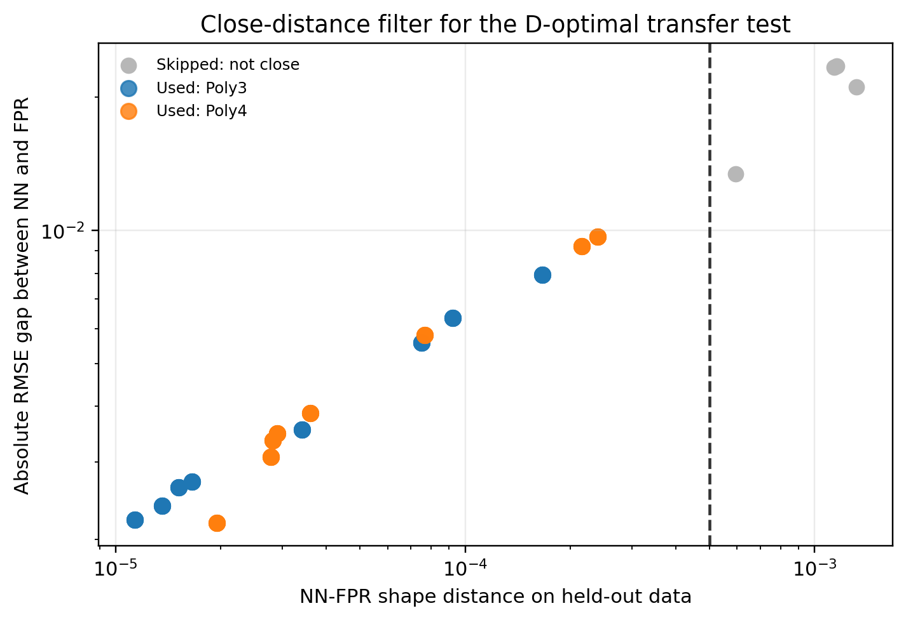
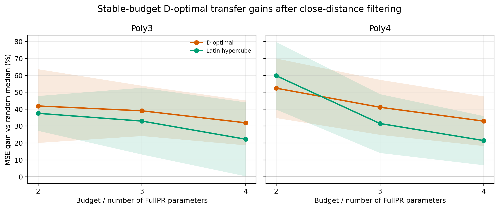
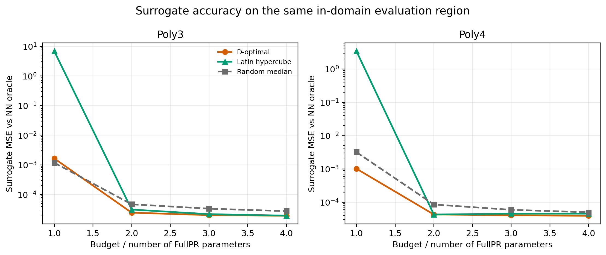

# 近距离条件下的 D-optimal 迁移实验小报告

## 1. 实验目的

本轮实验专门检验一个更聚焦的命题：

> 当 NN 和 FPR 在同一个数据区域内足够接近时，基于 FPR 特征空间的 D-optimal 实验设计，是否能比同预算随机采样更高效地逼近 NN。

前面的 D-optimal 结果之所以不够清楚，主要是因为候选域和距离测量域不完全一致：NN-FPR 距离是在数据区测的，但 D-optimal 有时会在更宽的 uniform 区域里选点，容易选到外推区高杠杆点，从而破坏“距离近”的前提。本轮实验把候选点限制在 training data region 内，使距离测量、选点、评估都处在同一数据分布下。

## 2. 实验设置

- 数据集：`paper_poly3` 和 `paper_poly4`。
- 输入维度：`p=3`。
- 原始样本数：`n=1000`，训练/评估划分为 `750/250`。
- NN 结构：`tanh` 激活，hidden=`16,8,4`，训练 `1500` epochs。
- FPR：三阶 FullPR，包含特殊项 `sin(x_i)` 和 `exp(x_i)`。
- FullPR 参数数：`26`。
- base run：`2` 个 case × `5` 个 data seed × `2` 个 init seed，共 `20` 个。
- 近距离筛选阈值：`shape_nn_fpr <= 5e-4`。
- 候选点：从训练数据区域中取最多 `750` 个候选点。
- 查询预算：`1x, 2x, 3x, 4x` FullPR 参数数，即 `26, 52, 78, 104` 个 NN 查询点。
- 随机基准：每个 run 和每个 budget 重复 `100` 次，使用 random median 作为基准。
- 对照设计：`D-optimal`、`Latin hypercube`、`Random median`。

## 3. 实验流程

每个 base run 先训练一个 NN，并在完整训练数据上拟合 FPR。随后在 held-out evaluation set 上计算 NN 和 FPR 的形状距离 `shape_nn_fpr`，以及二者相对真实 y 的 RMSE 差距 `abs_rmse_gap`。

只有通过近距离筛选的 base run 才进入 D-optimal 迁移测试。通过筛选后，把训练数据区域里的候选点映射成 FullPR 设计矩阵，并使用贪心 D-optimal 规则选出一批点。该规则等价于逐步选择能最大增加信息矩阵

```text
F_S^T F_S
```

行列式的候选点。直观上，它倾向于选择在 FPR 特征空间中覆盖方向更充分、信息量更高的点。

选点后，实验只在这些点上查询 NN 输出，再用这些 NN 输出拟合一个 FPR surrogate。最后在同一个 held-out evaluation set 上比较 surrogate 和 NN oracle 的 MSE。随机设计和 Latin hypercube 使用相同查询预算。

性能提升定义为：

```text
gain = (random median MSE - design MSE) / random median MSE * 100%
```

因此 gain 为正表示该实验设计优于同预算随机采样。

## 4. 近距离筛选结果

20 个 base run 中，有 16 个通过近距离筛选，4 个被跳过。通过筛选的 run 确实处在 NN-FPR 接近区间：

| Case | 通过 run 数 | median shape_nn_fpr | shape range | median abs_rmse_gap | gap range |
|---|---:|---:|---:|---:|---:|
| Poly3 | 8 | 2.5e-05 | 1.1e-05 到 1.66e-04 | 3.12e-03 | 2.22e-03 到 7.94e-03 |
| Poly4 | 8 | 3.3e-05 | 1.9e-05 到 2.39e-04 | 3.67e-03 | 2.18e-03 到 9.68e-03 |

这说明后续设计比较并不是在任意场景中做的，而是在 NN 和 FPR 已经非常接近的条件下做的。



## 5. 主要结果

完整 budget 结果如下：

| Case | Budget | D-optimal gain | Latin gain | 重复数 |
|---|---:|---:|---:|---:|
| Poly3 | 1x | -94.83% | -737563.72% | 8 |
| Poly3 | 2x | 41.89% | 37.54% | 8 |
| Poly3 | 3x | 39.03% | 32.96% | 8 |
| Poly3 | 4x | 31.94% | 22.23% | 8 |
| Poly4 | 1x | 8.74% | -776310.90% | 8 |
| Poly4 | 2x | 52.39% | 59.76% | 8 |
| Poly4 | 3x | 41.13% | 31.52% | 8 |
| Poly4 | 4x | 32.93% | 21.44% | 8 |

1x 参数预算不适合放进主结论。此时查询点数刚好等于 FullPR 参数数，线性 surrogate 拟合接近临界可解，设计矩阵容易病态；Latin hypercube 出现了极端负值，D-optimal 也有明显不稳定。因此更合理的主分析应关注 `budget >= 2x` 的稳定预算区间。

在 `2x, 3x, 4x` 参数预算下，结果明显支持 D-optimal 的设计优势：

| 方法 | mean gain | median gain | 正收益率 | 样本数 |
|---|---:|---:|---:|---:|
| D-optimal | 39.89% | 44.13% | 93.75% | 48 |
| Latin hypercube | 34.24% | 38.72% | 87.50% | 48 |

按预算分解：

| Budget | D-optimal mean gain | D-optimal median gain | D-optimal 正收益率 | Latin mean gain | Latin median gain | Latin 正收益率 |
|---:|---:|---:|---:|---:|---:|---:|
| 2x | 47.14% | 48.99% | 93.75% | 48.65% | 49.43% | 93.75% |
| 3x | 40.08% | 45.25% | 100.00% | 32.24% | 37.81% | 87.50% |
| 4x | 32.43% | 37.32% | 87.50% | 21.84% | 24.86% | 81.25% |

其中 `3x` 参数预算最适合作为论文主结果：它避免了 1x 的病态，又比 4x 更能体现样本效率。此时 D-optimal 在所有重复中均为正收益，平均 MSE gain 为 `40.08%`，中位 gain 为 `45.25%`。



MSE 曲线也给出同样结论：从 2x 开始，D-optimal surrogate 的 MSE 系统性低于 random median，说明 D-optimal 并不是只在百分比指标上好看，而是真正降低了 surrogate 相对 NN oracle 的误差。



## 6. 分析与解释

本轮结果支持理论命题，但需要带条件地表述：

> 在 NN 和 FPR 于同一数据区域内距离较近，并且查询预算至少达到约 2 倍 FullPR 参数数时，FPR-based D-optimal 设计能够比同预算随机采样更高效地逼近 NN。

这个结论比前一轮更强，因为它修正了两个混淆因素。第一，候选点不再来自整个 uniform cube，而是来自 training data region，因此 D-optimal 选点不会跑到 NN-FPR closeness 未被验证的外推区域。第二，实验先用 close filter 排除了 NN-FPR 距离不够近的 base run，使后续比较真正发生在理论命题要求的条件下。

D-optimal 的优势主要体现在 2x 到 4x 参数预算区间。2x 时提升最大，但 Latin hypercube 也很强；3x 时 D-optimal 的稳定性最好，正收益率达到 100%；4x 时仍有稳定正收益，但边际收益下降，说明随机设计随着预算增加也逐渐追上来。

1x 预算的异常不应被解释为 D-optimal 理论失败。它更像是线性 surrogate 在刚好等于参数数的样本量下出现的数值病态：只要设计点稍微共线或覆盖不足，拟合误差就会被放大。因此论文里应避免把 1x 作为主证据，而应将其作为“低预算临界区不稳定”的说明。

## 7. 结论

这轮实验终于清楚展示了实验设计的优势：在严格限定的 NN-FPR 近距离、同域候选、同域评估条件下，D-optimal 相比随机设计有稳定而显著的 MSE 改善。

推荐论文表述为：

> When the NN and FullPR surrogate are close on the same in-domain region, and the query budget is moderately overparameterized relative to the FullPR basis, FullPR-based D-optimal design substantially improves NN distillation over random sampling.

中文可以写成：

> 当 NN 与 FPR 在同一数据区域内足够接近，并且查询预算达到 FullPR 参数数的约 2 到 4 倍时，基于 FPR 特征空间的 D-optimal 设计能够显著优于同预算随机采样，从而更高效地完成对 NN oracle 的采样和代理拟合。

最适合放入正文的主结果是 `3x` 参数预算：D-optimal 平均提升约 `40.08%`，中位提升约 `45.25%`，正收益率为 `100%`。

## 8. 输出文件

- 原始结果：`data/close_distance_dopt/close_distance_dopt_raw.csv`
- 汇总结果：`data/close_distance_dopt/close_distance_dopt_aggregate.csv`
- 英文简报：`reports/notes/close_distance_dopt_report.md`
- 本中文小报告：`reports/notes/close_distance_dopt_cn_report.md`
- 近距离筛选图：`figures/close_distance_dopt/close_distance_dopt_close_filter.png`
- 完整 gain 图：`figures/close_distance_dopt/close_distance_dopt_gain_by_budget.png`
- 稳定预算 gain 图：`figures/close_distance_dopt/close_distance_dopt_gain_by_budget_stable.png`
- MSE 曲线图：`figures/close_distance_dopt/close_distance_dopt_mse_by_budget.png`
