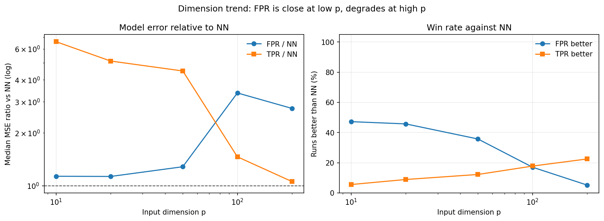
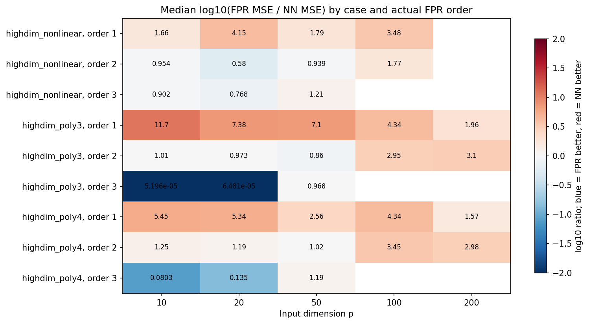
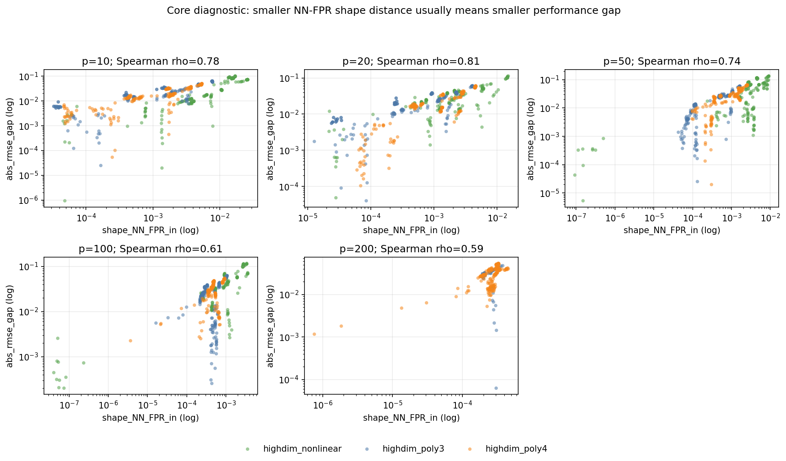
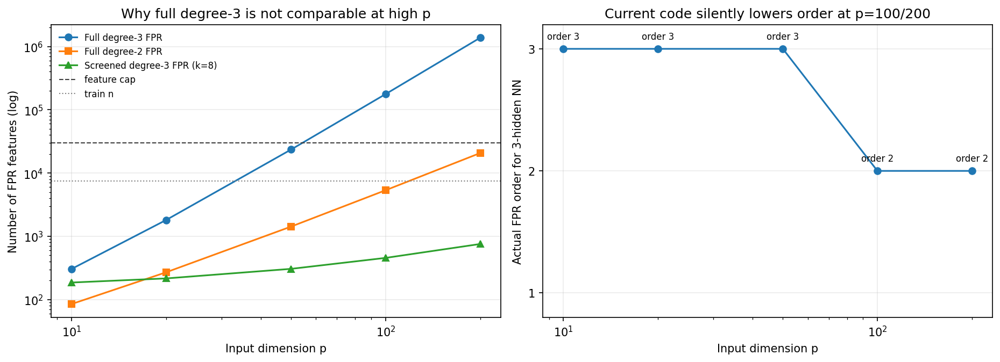

# GPU 高维 NN-FPR 几何等价实验小报告

## 1. 本轮实验要回答的问题

本轮实验的核心问题是：在不同输入维度 `p`、不同真实函数设定、不同激活函数和不同网络深度下，`FPR` 与 `NN` 的距离是否能作为性能接近或形状接近的诊断指标。

这里应区分两个命题：

1. **形状距离命题**：`shape_NN_FPR_in` 越小，NN 和 FPR 的响应曲面越接近。
2. **性能诊断命题**：`shape_NN_FPR_in` 越小，NN 与 FPR 相对真实 y 的性能差距 `abs_rmse_gap` 通常越小。

当前数据支持第二个命题的“诊断”版本，而不支持把它写成“距离小必然保证 FPR 更好或完全替代 NN”。

## 2. 数据范围和完整性

- 原始结果文件：`geom_gpu_noltpr_p10_raw.csv`、`geom_gpu_noltpr_p20_raw.csv`、`geom_gpu_noltpr_p50_raw.csv`、`geom_gpu_noltpr_p100_raw.csv`、`geom_gpu_noltpr_p200_raw.csv`。
- 相关性文件：p=10、20、50、100 有 correlation 文件；p=200 当前没有 correlation 文件。
- `LTPR` 相关列在本轮实验中全部为空，因为运行脚本使用了 `--ltpr-max-p 0`，即高维实验完全跳过 LayerTaylor-PR。
- p=200 只有 231 行，并且缺少 `highdim_nonlinear`，因此 p=200 可以作为高维趋势参考，但不应与 p=10/20/50/100 做完全公平的全配置比较。

## 3. 每个变量的含义

- `case`：数据生成机制/实验场景。`highdim_poly3` 是三阶多项式真函数；`highdim_poly4` 是四阶多项式真函数；`highdim_nonlinear` 是含正弦与交互项的非多项式真函数。
- `activation`：NN 使用的激活函数，例如 `softplus`、`tanh`、`sigmoid`。它决定网络非线性的形状，也影响泰勒类近似的稳定性。
- `hidden`：隐藏层宽度配置。`64` 表示单隐层 64 个神经元；`128,64` 表示两隐层；`256,128,64` 表示三隐层。
- `n_hidden`：隐藏层层数，由 `hidden` 的长度得到。当前实验中为 1、2、3。
- `q`：Taylor-PR 的泰勒展开阶数参数。当前数据中为 3，但 GPU 脚本又受 `SAFE_MAX_ORDER=3` 限制。
- `data_seed`：数据集随机种子。控制 X、真实函数系数、噪声等数据生成随机性。
- `init_seed`：NN 初始化随机种子。控制网络初始权重和训练随机性；同一配置下重复多次用于估计稳定性。
- `special`：FullPR 是否额外加入特殊函数特征。为 True 时，每个输入变量额外加入 `sin(x_i)` 和 `exp(x_i)` 两类特征。
- `n`：总样本数。当前实验为 10000，训练/测试拆分后约 7500/2500。
- `p`：输入维度，也就是自变量个数。当前实验扫 10、20、50、100、200。
- `max_order`：本次 FullPR/FPR 实际使用的最高多项式总阶数。它不是简单随 p 增加，而是由隐藏层数、`SAFE_MAX_ORDER` 和特征数上限共同决定。
- `NN_mse_vs_y`：NN 预测相对真实测试标签 y 的均方误差。越小表示 NN 本身预测越准。
- `act_io_mean`：各隐藏层从 pre-activation `u` 到 activation 输出 `g(u)` 的形状/响应变化距离的平均值。反映平均每层注入了多少非线性。
- `act_io_sum`：各隐藏层 `u -> g(u)` 距离之和。比 `act_io_mean` 更强调深度累积的总非线性。
- `TPR_mse_vs_NN`：Taylor-PR 预测相对 NN 输出的均方误差。衡量 Taylor-PR 是否能复刻 NN。当前只有单隐层时计算。
- `TPR_mse_vs_y`：Taylor-PR 预测相对真实 y 的均方误差。衡量 Taylor-PR 自身预测性能。
- `LTPR_mse_vs_NN`：LayerTaylor-PR 预测相对 NN 输出的均方误差。当前这批 `noltpr` 实验中全部为空，因为运行时设置 `--ltpr-max-p 0` 跳过了 LTPR。
- `LTPR_mse_vs_y`：LayerTaylor-PR 预测相对真实 y 的均方误差。本批数据为空，不能据此下 LTPR 结论。
- `LTPR_n_terms`：LayerTaylor-PR 展开后得到的多项式项数。本批数据为空。
- `shape_NN_LTPR`：NN 与 LayerTaylor-PR 在测试数据区响应曲面 `[X, yhat]` 上的 Procrustes 形状距离。本批数据为空。
- `FPR_mse_vs_y`：FullPR/FPR 预测相对真实 y 的均方误差。越小表示 FPR 自身预测越准。
- `FPR_mse_vs_NN`：FPR 预测相对 NN 输出的均方误差。衡量 FPR 是否能复刻 NN，是“像不像 NN”的直接误差指标。
- `FPR_r2_vs_y`：FPR 相对真实 y 的 R2。越接近 1 表示解释真实 y 的方差比例越高；负值表示比常数均值预测还差。
- `shape_NN_FPR_in`：NN 与 FPR 在测试数据区响应曲面 `[X, yhat]` 上的 Procrustes 形状距离。越小表示二者在数据区形状越接近。
- `mahal_NN_FPR`：NN 与 FPR 输出差异的 Mahalanobis 平均距离。它考虑输出差异的协方差结构，比普通欧氏差异更带统计尺度。
- `shape_NN_FPR_ext`：NN 与 FPR 在外推区响应曲面上的形状距离。外推区由更宽输入范围采样得到，衡量离开训练/测试分布后的形状一致性。
- `abs_rmse_gap`：`abs(sqrt(NN_mse_vs_y) - sqrt(FPR_mse_vs_y))`。这是 NN 与 FPR 相对真实 y 的 RMSE 性能差距，越小表示性能越接近。
- `NN_FPR_log10`：`log10(NN_mse_vs_y / FPR_mse_vs_y)`。大于 0 表示 NN 的 MSE 大于 FPR，即 FPR 更好；小于 0 表示 NN 更好。
- `FPR_mse_delta_vs_NN`：`FPR_mse_vs_y - NN_mse_vs_y`。负值表示 FPR 比 NN 更准，正值表示 FPR 更差。
- `FPR_improve_vs_NN_pct`：`(NN_mse_vs_y - FPR_mse_vs_y) / NN_mse_vs_y * 100%`。正值表示 FPR 相对 NN 改善，负值表示退化。
- `FPR_better_than_NN`：布尔指标。True 表示该 run 中 FPR 的 MSE 小于 NN 的 MSE。
- `TPR_mse_delta_vs_NN`：`TPR_mse_vs_y - NN_mse_vs_y`。负值表示 TPR 比 NN 更准。
- `TPR_improve_vs_NN_pct`：`(NN_mse_vs_y - TPR_mse_vs_y) / NN_mse_vs_y * 100%`。正值表示 TPR 相对 NN 改善。
- `TPR_better_than_NN`：布尔指标。True 表示 TPR 的 MSE 小于 NN 的 MSE。当前只对单隐层有效。
- `LTPR_mse_delta_vs_NN`：`LTPR_mse_vs_y - NN_mse_vs_y`。本批数据为空。
- `LTPR_improve_vs_NN_pct`：`(NN_mse_vs_y - LTPR_mse_vs_y) / NN_mse_vs_y * 100%`。本批数据为空。
- `LTPR_better_than_NN`：布尔指标。True 表示 LTPR 的 MSE 小于 NN 的 MSE。本批数据为空/不可用。
- `well_specified`：是否为设定匹配的对照。当前代码定义为 `case == highdim_poly3` 且 `n_hidden == 3`，因为三隐层对应三阶 FPR，在低/中维时可以命中三阶真函数。

## 4. 维度层面的总体结论

| source_p | n | cases | NN | FPR | TPR | FPR_ratio | TPR_ratio | FPR_better | TPR_better | shape_in | abs_gap |
| --- | --- | --- | --- | --- | --- | --- | --- | --- | --- | --- | --- |
| 10 | 540 | 3 | 8.4179e-04 | 0.003518 | 0.01288 | 1.132 | 6.599 | 47.2% | 5.6% | 0.001889 | 0.01675 |
| 20 | 540 | 3 | 9.6986e-04 | 0.001159 | 0.01611 | 1.129 | 5.12 | 45.7% | 8.9% | 0.001266 | 0.02071 |
| 50 | 540 | 3 | 0.002105 | 0.004651 | 0.04288 | 1.282 | 4.496 | 35.7% | 12.2% | 0.001053 | 0.02477 |
| 100 | 540 | 3 | 0.001677 | 0.004141 | 0.02377 | 3.371 | 1.46 | 17.0% | 17.8% | 5.2448e-04 | 0.03066 |
| 200 | 231 | 2 | 0.002383 | 0.005737 | 0.00615 | 2.753 | 1.056 | 5.2% | 22.5% | 2.6643e-04 | 0.03061 |

解读：

- p=10 和 p=20 时，FPR 的中位 MSE 大约是 NN 的 1.13 倍，胜率接近 46%-47%。这说明低维时 FPR 与 NN 已经处在可以正面对比的区域。
- p=50 时，FPR 中位误差比升到 1.28，胜率降到 35.7%，开始出现高维退化。
- p=100 和 p=200 时，FPR 明显退化，中位误差比分别约为 3.37 和 2.75，胜率降到 17.0% 和 5.2%。
- TPR 在单隐层上才有结果。随着 p 变高，TPR/NN 的中位误差比下降，但胜率仍然较低，说明它更像一个局部解释工具，而不是稳定预测模型。



## 5. 分 case 的结果

| case | source_p | n | FPR_ratio | FPR_better | shape_in | abs_gap |
| --- | --- | --- | --- | --- | --- | --- |
| highdim_nonlinear | 10 | 180 | 1.279 | 43.9% | 0.007583 | 0.01763 |
| highdim_nonlinear | 20 | 180 | 1.314 | 40.0% | 0.002123 | 0.02895 |
| highdim_nonlinear | 50 | 180 | 1.151 | 35.6% | 0.003701 | 0.05028 |
| highdim_nonlinear | 100 | 180 | 2.517 | 35.6% | 9.2465e-04 | 0.03631 |
| highdim_poly3 | 10 | 180 | 1.01 | 50.0% | 0.001459 | 0.01726 |
| highdim_poly3 | 20 | 180 | 0.7965 | 56.7% | 8.5050e-04 | 0.01948 |
| highdim_poly3 | 50 | 180 | 1.416 | 36.7% | 4.8160e-04 | 0.01597 |
| highdim_poly3 | 100 | 180 | 3.459 | 13.9% | 4.1862e-04 | 0.02438 |
| highdim_poly3 | 200 | 51 | 2.818 | 3.9% | 2.5298e-04 | 0.03087 |
| highdim_poly4 | 10 | 180 | 1.127 | 47.8% | 0.001597 | 0.01479 |
| highdim_poly4 | 20 | 180 | 1.209 | 40.6% | 0.001297 | 0.01682 |
| highdim_poly4 | 50 | 180 | 1.369 | 35.0% | 8.1147e-04 | 0.02471 |
| highdim_poly4 | 100 | 180 | 4.193 | 1.7% | 4.9058e-04 | 0.03234 |
| highdim_poly4 | 200 | 180 | 2.696 | 5.6% | 2.7454e-04 | 0.02987 |

解读：

- `highdim_poly3` 在低维且三阶 FPR 可用时表现最好，符合“真函数阶数与 FPR 阶数匹配”的预期。
- `highdim_poly4` 是严格欠设定：即使三隐层最多也只给到三阶 FPR，无法完整表达四阶真函数，所以高维后 NN 更稳。
- `highdim_nonlinear` 不是多项式真函数，FPR 的优势取决于数据区局部是否可由低阶/特殊函数特征近似；它更适合用来测试“距离指标是否能诊断可迁移性”，而不是测试 FPR 是否必然胜过 NN。



## 6. 核心诊断：形状距离是否代表性能接近

相关性摘要如下，使用的是 Spearman 秩相关：

| source_p | spearman_rho | p_value | n |
| --- | --- | --- | --- |
| 10 | 0.776 | 9.874e-110 | 540 |
| 20 | 0.814 | 3.730e-129 | 540 |
| 50 | 0.736 | 2.607e-93 | 540 |
| 100 | 0.613 | 4.876e-57 | 540 |

这组结果非常关键：`shape_NN_FPR_in -> abs_rmse_gap` 在 p=10/20/50/100 上都显著为正，相关强度约 0.61 到 0.81。也就是说，数据区内 NN-FPR 形状距离越小，NN 与 FPR 相对真实 y 的性能差距通常越小。

这支持你的核心想法：**FPR 和 NN 的距离可以作为性能接近和形状接近的强诊断指标。**

但应注意：

- 它是诊断指标，不是充分条件。
- 它更能预测“NN 和 FPR 的性能差距是否小”，不等同于预测“FPR 是否一定比 NN 更准”。
- 当高维下 FPR 阶数被降阶、特征空间欠表达、或 NN 训练不稳定时，距离-性能关系仍可能存在，但胜负关系会受其他因素影响。



## 7. 当前代码中的可比性问题

当前 GPU 代码中，FPR 的实际阶数由以下逻辑决定：

```python
requested = min(n_hidden, SAFE_MAX_ORDER)
for order in range(requested, 0, -1):
    if estimate_fullpr_feature_count(p, order, include_special) <= FULLPR_FEATURE_CAP:
        return order
```

因此，FPR 阶数不会随 `p` 增高而增加。相反，当 p 太高导致完整交互特征数超过上限时，代码会自动降阶。

当前三种深度下的实际 FPR 阶数和特征数为：

| p | n_hidden | actual_max_order | feature_count |
| --- | --- | --- | --- |
| 10 | 1 | 1 | 30 |
| 10 | 2 | 2 | 85 |
| 10 | 3 | 3 | 305 |
| 20 | 1 | 1 | 60 |
| 20 | 2 | 2 | 270 |
| 20 | 3 | 3 | 1810 |
| 50 | 1 | 1 | 150 |
| 50 | 2 | 2 | 1425 |
| 50 | 3 | 3 | 23525 |
| 100 | 1 | 1 | 300 |
| 100 | 2 | 2 | 5350 |
| 100 | 3 | 2 | 5350 |
| 200 | 1 | 1 | 600 |
| 200 | 2 | 2 | 20700 |
| 200 | 3 | 2 | 20700 |

这带来一个解释风险：p=10/20/50 的三隐层 NN 对应三阶 FPR，但 p=100/200 的三隐层 NN 对应二阶 FPR。因此高维结果同时混入了两个变化：

1. 输入维度 p 变高；
2. 三隐层设置下 FPR 从三阶被压到二阶。

这会削弱“不同 p 之间三隐层结果可比”的严谨性。

## 8. 推荐的高维可比方案：Screened FPR-3

最可行的方案是：**固定 NN 深度仍为 1/2/3，但把三隐层对应的 FPR 始终保持为三阶；为了避免高维完整三阶组合爆炸，只在筛选出的 k 个变量上生成三阶交互，对所有变量保留主效应和特殊函数特征。**

具体做法：

1. 先用训练集或 pilot subset 选择固定数量的活跃变量，例如 `k=8`。合成实验中可以用真实设定的前 8 个 active variables 做 sanity check；正式论文实验中更好用可观测规则，例如边际相关、Lasso、随机森林重要性或 NN 输入梯度筛选。
2. 对这 k 个变量生成完整三阶多项式交互。
3. 对所有 p 个变量保留一阶主效应。
4. 如果 `special=True`，仍对所有 p 个变量保留 `sin(x_i)` 和 `exp(x_i)`。
5. 这样三隐层设置在 p=10/20/50/100/200 下都是真正的“三阶 FPR”，只是三阶交互被限制在同样规模的候选活跃子空间内。

特征数对比如下：

| p | full_degree_3_features | current_3_hidden_order | screened_degree_3_k8_features |
| --- | --- | --- | --- |
| 10 | 305 | 3 | 186 |
| 20 | 1810 | 3 | 216 |
| 50 | 23525 | 3 | 306 |
| 100 | 177050 | 2 | 456 |
| 200 | 1374100 | 2 | 756 |

为什么这个方案可比：

- 它保证三隐层设置在所有 p 下都对应三阶 FPR，不再出现 p=100/200 被降到二阶的问题。
- 它保持每个 p 下的高阶交互容量大致同一量级，高维增加主要体现在噪声变量和筛选难度，而不是完整三阶特征数爆炸。
- 它适合你的科学问题：你关心的是“NN-FPR 距离能否诊断性能/形状接近”，而不是单纯测试一个无法估计的百万级完整三阶设计矩阵。



## 9. 建议的论文表述

可以写：

> Across dimensions, cases, activations and network depths, the in-domain NN-FPR response-surface distance is strongly associated with the NN-FPR performance gap. This supports using NN-FPR geometric distance as a practical diagnostic for whether a polynomial surrogate is close to the neural network in both shape and predictive behavior.

中文对应：

> 在不同维度、不同真函数设定、不同激活函数和不同网络深度下，数据区内 NN-FPR 响应曲面距离与 NN-FPR 性能差距稳定正相关。这说明 NN-FPR 几何距离可以作为一个实际可观测的诊断指标，用于判断多项式代理是否在形状和预测行为上接近神经网络。

但不要写成：

> 只要 NN-FPR 距离小，FPR 就一定优于 NN。

更严谨的限定是：

> 距离小通常意味着二者性能差距小；是否 FPR 胜过 NN，还取决于真函数是否落在 FPR 特征族内、FPR 阶数容量、输入维度、样本量、激活函数和 NN 训练稳定性。
